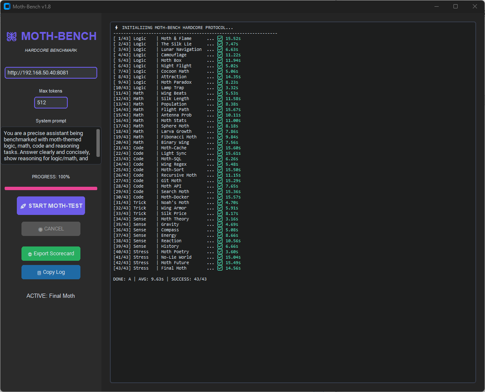
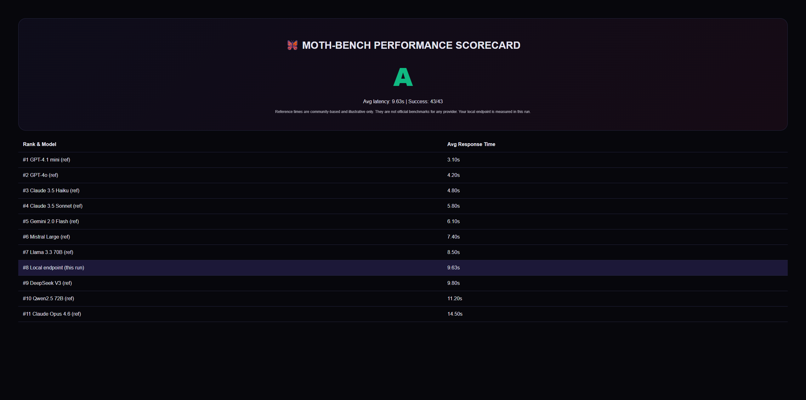

\# 🦋 MOTH-BENCH v1.8




*A hardcore benchmark battery for local LLMs, specifically tuned for Ollama and v1/chat/completions endpoints.*

---

### 🌐 The Scorecard
After the test, you get a full performance report:


\*\*A clean, playful and practical end-to-end latency benchmark for local LLM endpoints.\*\*


Moth-Bench is a standalone GUI application for benchmarking any  

\*\*/v1/chat/completions-compatible\*\* language model endpoint (OpenAI-style API).


It runs \*\*43 fixed tests\*\* covering logic, math, coding, reasoning and trick questions.  

The tool measures \*\*full end-to-end response latency\*\*, which reflects real-world usage more accurately than TTFT (time-to-first-token).


Moth-Bench exports a \*\*beautiful HTML scorecard\*\* including a latency leaderboard using community reference models.


✔ Available as \*\*Windows EXE\*\* (no Python required)  

✔ Full source code included in this repository


---


\## ✨ Features


\- \*\*43 deterministic test prompts\*\*

\- \*\*Full end-to-end latency measurement\*\* (not TTFT)

\- \*\*CustomTkinter GUI (Python version)\*\*

\- \*\*Standalone Windows .exe\*\* (no dependencies)

\- \*\*Adjustable system prompt \& max tokens\*\*

\- \*\*Live per-test logging and timing\*\*

\- \*\*Cancel support\*\*

\- \*\*HTML Scorecard with leaderboard\*\*

\- \*\*Community reference benchmarks\*\*

\- \*\*Open and modifiable test suite\*\*


---


\## 📦 Installation


\### Windows (Recommended)


Download the EXE from the \*\*Releases\*\* page:


👉 `moth-bench.exe`  

No Python installation is required.


Place `benchmarks.json` in the same folder as the EXE.


---


\### Python version (Developers)


```bash

pip install -r requirements.txt

python moth\_bench.py

```


Requires:


\- Python 3.10+

\- customtkinter

\- requests


---


\## 🚀 Usage


1\. Start \*\*Moth-Bench\*\*

2\. Enter your LLM endpoint, for example:


```

http://127.0.0.1:8081/v1

```


3\. Optional adjustments:

&nbsp;  - \*\*Max tokens\*\* (default 512)

&nbsp;  - \*\*System prompt\*\*


4\. Click \*\*START MOTH-TEST\*\*


5\. Wait for all 43 tasks to complete


6\. Export your \*\*HTML Scorecard\*\*


---


\## 🧩 Benchmark Test Suite


Moth-Bench includes \*\*43 handcrafted tests\*\* across:


\- Logic

\- Math

\- Code (Python, SQL, Regex, algorithms)

\- Physics / intuition

\- Trick questions

\- Stress / creativity tasks


The test suite is embedded directly in `moth\_bench.py` for full transparency.


---


\## 🧠 Default System Prompt


Moth-Bench uses the following default system prompt:


> \*\*"You are a precise assistant being benchmarked with moth-themed logic, math, code and reasoning tasks.  

> Answer clearly and concisely, show reasoning for logic/math, and return valid code where requested."\*\*


The user may freely change this in the GUI.


---


\## 📊 Reference Benchmark Models (community estimates)


Because Moth-Bench measures \*\*full-response latency\*\*, vendor TTFT benchmarks cannot be compared directly.


To make comparisons meaningful, Moth-Bench includes a set of  

\*\*community-based end-to-end latency estimates\*\* stored in `benchmarks.json`:


```json

\[

&nbsp; { "name": "GPT-4.1 mini (ref)", "avg\_seconds": 3.1 },

&nbsp; { "name": "GPT-4o (ref)", "avg\_seconds": 4.2 },

&nbsp; { "name": "Claude 3.5 Haiku (ref)", "avg\_seconds": 4.8 },

&nbsp; { "name": "Claude 3.5 Sonnet (ref)", "avg\_seconds": 5.8 },

&nbsp; { "name": "Gemini 2.0 Flash (ref)", "avg\_seconds": 6.1 },

&nbsp; { "name": "Mistral Large (ref)", "avg\_seconds": 7.4 },

&nbsp; { "name": "Llama 3.3 70B (ref)", "avg\_seconds": 8.5 },

&nbsp; { "name": "DeepSeek V3 (ref)", "avg\_seconds": 9.8 },

&nbsp; { "name": "Qwen2.5 72B (ref)", "avg\_seconds": 11.2 },

&nbsp; { "name": "Claude Opus 4.6 (ref)", "avg\_seconds": 14.5 }

]

```


During a benchmark run, Moth-Bench automatically adds:


```

Local endpoint (this run)

```


…with the measured average latency.


\### ⚠ Disclaimer


> These values are \*\*community-based estimates\*\*, not official vendor benchmarks.  

> You may edit or replace `benchmarks.json` with your own measured values.


---


\## 🖼 Screenshots


\*(Add screenshots here)\*


---


\## 📁 Project Structure


```

moth-bench/

├── moth\_bench.py

├── benchmarks.json

├── requirements.txt

├── LICENSE

└── README.md

```


---


\## 👨‍💻 Building the EXE (Developers)


Python is \*\*only required to build the executable\*\*, not to run the distributed EXE.


```bash

pyinstaller --noconfirm --onefile --windowed --collect-all customtkinter moth\_bench.py

```


Built executable:


```

dist/moth\_bench.exe

```


---


\## 📜 License


MIT License © 2026 Christian Hay


---


\## 🤝 Contributing


Pull requests are welcome.  

Extensions to the test suite, UI improvements, and benchmark enhancements are appreciated.

